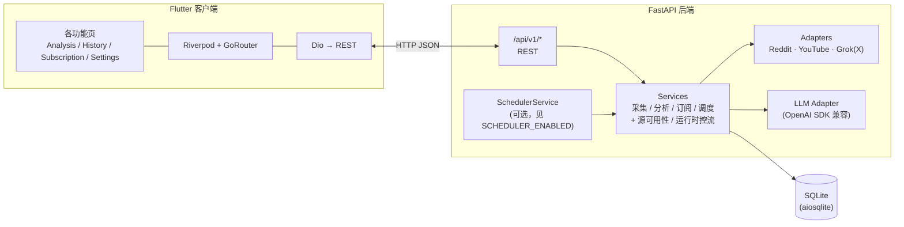

# TrendPulse - 多源舆情分析系统

<p align="center">
  
</p>

## 项目介绍

**TrendPulse** 是一款面向「关键词 → 多平台采集 → AI 舆情报告」的端到端系统：用户在 App 中输入主题词，后端并行从 **Reddit**（官方 API）、**YouTube**（Data API + 字幕）、**X** [通过 Grok / OpenAI 兼容 API] 拉取近期内容，经清洗落库后，由 **LLM** 完成情感打分、观点聚类与摘要，最终在 Flutter 客户端展示仪表盘、报告、原始帖文与订阅监控结果。

**典型场景**：快速了解某一产品或话题在英文/中文社区的整体情绪、争议点与热度，并支持按周期自动复扫与负面阈值提醒。

**与仓库内文档的关系**（可选阅读）：

- 需求与范围说明：`docs/Objective.md`
- 采集策略、分析 Prompt、实现侧问题与对策：`docs/技术说明-采集策略与AI-Prompt.md`
- X / Grok 采集演进与经验：`docs/GROK_API_INTEGRATION_REPORT.md`（其中分片数量与批大小以当前 `backend/src/adapters/x_adapter.py` 与上一篇技术说明为准）

自动化验收与回归以 `scripts/verify-critical-paths.sh` 及 `backend/tests/`、`app/test/` 为准；`docs/` 目录当前含上述三份 Markdown，无独立「演示 runbook」文件。

## 功能特性

- **多源采集**: Reddit / YouTube / X，适配器在 `backend/src/adapters/`（`reddit_adapter.py`、`youtube_adapter.py`、`x_adapter.py`），由 `backend/src/services/collector_service.py` 编排；X/Grok 侧另有运行时并发槽位与失败冷却（`backend/src/services/source_runtime_control.py`，供 `source_availability_service` 与 `GET /api/v1/settings/sources` 等逻辑使用）
- **AI 分析**: Map-Reduce 链式处理（`backend/src/services/analyzer_service.py`），情感分析 + 核心观点提取 + 热度指标
- **实时仪表盘**: 情感得分、热度指数、核心观点卡片、情感分布
- **历史记录**: 查看过往分析任务，支持删除
- **订阅监控**: 按关键词与周期创建订阅，自动拉取并生成任务；支持「立即再跑一轮」
- **负面告警**: 订阅任务低于阈值（如 `sentiment_score < 30`）时产生未读告警，App 内可标记已读
- **Mermaid 思维导图**: 报告字段 `mermaid_mindmap`（`backend/src/models/schemas.py`）；由 `backend/src/services/analyzer_service.py` 中模块级函数 `**build_mermaid_mindmap`**（及分析管线）生成；Flutter 侧解析与降级文案见 `app/lib/features/detail/presentation/widgets/mermaid_mindmap_card.dart` 与 `app/lib/l10n/*`
- **源数据浏览**: 任务详情中按平台筛选原始帖子，跳转原文
- **分析页起步话题**: 推荐点击词为 Flutter 本地化静态列表（`app/lib/features/analysis/presentation/widgets/analysis_marketing_sections.dart`），无对应 REST 接口
- **主题切换**: 浅色/深色主题（实现见 `app/lib/core/theme/app_theme.dart`）

## 系统架构

### 架构图（Mermaid）

在 GitHub、GitLab 及部分 Markdown 预览中可直接渲染下图。




### 后端分层（逻辑视图）


| 层次    | 目录                           | 职责                                     |
| ----- | ---------------------------- | -------------------------------------- |
| HTTP  | `backend/src/api/endpoints/` | 路由、校验入参、映射 HTTP 状态码                    |
| 领域与编排 | `backend/src/services/`      | 任务、采集、分析、订阅、调度、设置                      |
| 外部系统  | `backend/src/adapters/`      | Reddit / YouTube / X(Grok) / LLM 等 API |
| 数据    | `backend/src/models/`        | Schema、SQLite 访问与初始化                   |


### 技术栈速览


| 组件  | 技术                                                                                                                                                                                  |
| --- | ----------------------------------------------------------------------------------------------------------------------------------------------------------------------------------- |
| 移动端 | Flutter 3.x（以 `app/pubspec.yaml` 中 `sdk` 约束为准）、Riverpod、GoRouter、Dio                                                                                                                |
| 服务端 | Python 3.10+、FastAPI、Uvicorn、Pydantic v2                                                                                                                                            |
| 存储  | SQLite；连接串字段 `**database_url**`，默认值为 `sqlite+aiosqlite:///./trendpulse.db`（见 `backend/src/config/settings.py`）；可用环境变量覆盖，命名遵循 **Pydantic Settings** 对字段名的解析规则（实践中常使用 `DATABASE_URL`） |
| AI  | OpenAI 兼容 SDK（分析用 LLM + Grok/兼容端点采集 X）                                                                                                                                              |


**平台说明**：本仓库包含完整的 `**app/android/`** 工程；**不包含** `app/ios/` 目录。若需构建 iOS，请在本地通过 `flutter create` 补齐平台目录或从既有工程同步。

**默认数据库文件**：未改 `DATABASE_URL` 时，后端进程工作目录下会生成/使用 `**backend/trendpulse.db`**。开发脚本 `scripts/dev-android.sh --purge-data` 会删除该文件以便清空数据。

**采集时间窗**：各源「最近多少小时内的内容」由环境变量 `**COLLECTION_RECENCY_HOURS`**（字段名 `collection_recency_hours`，默认 24，范围 1–168）控制，详见 `backend/src/config/settings.py`。

> 以下为终端内无需 Mermaid 也可查看的简化示意图：

```
┌─────────────────────────────────────────┐
│       Flutter App (前端)                 │
│  Analysis │ History │ Subscription │ Settings │
│  Riverpod │ GoRouter │ Dio              │
└──────────────┬──────────────────────────┘
               │ HTTP/REST (JSON)
┌──────────────▼──────────────────────────┐
│      FastAPI Backend (后端)             │
│  Adapters (Reddit / YouTube / Grok)     │
│  Services + Scheduler + LLM Analyzer    │
│              SQLite                      │
└─────────────────────────────────────────┘
```

## 本地运行步骤

### 环境要求

- **Python**：`backend/pyproject.toml` 中 `requires-python` 为 `**>=3.10`**
- **Flutter**：版本需满足 `app/pubspec.yaml` 中 `environment.sdk`（当前声明为 `**^3.11.1`**）
- **凭证**（复制 `backend/.env.example` 为 `backend/.env` 后填写）：
  - Reddit API（[reddit.com/prefs/apps](https://www.reddit.com/prefs/apps)）
  - YouTube Data API Key（[Google Cloud Console](https://console.cloud.google.com/)）
  - Grok / xAI 或兼容网关（X 数据；见 `.env.example` 内 `GROK_*` 说明）
  - LLM（OpenAI 兼容，用于分析报告）

**配置项完整性**：`backend/.env.example` 仅列出常用变量；**未出现在示例文件中**的运行项仍以 `backend/src/config/settings.py` 为准，例如：默认数据库连接串字段 `**database_url`**（默认 `"sqlite+aiosqlite:///./trendpulse.db"`）、`**COLLECTION_RECENCY_HOURS**`、Grok 请求超时 `**GROK_HTTP_TIMEOUT**`（字段 `grok_http_timeout_seconds`，默认 45s），以及 X/Grok 批处理与重试相关的 `**X_BATCH_SIZE**`、`**X_PARALLEL_BATCHES**`、`**X_RETRY_MAX_ATTEMPTS**`、`**X_RETRY_BASE_DELAY_SECONDS**`、`**X_FAILURE_THRESHOLD**`、`**X_COOLDOWN_SECONDS**`（均为 `Field(validation_alias=...)`，见该文件）。示例文件中已包含 `**REDDIT_HTTP_TIMEOUT**`（映射 `reddit_http_timeout_seconds`）。

### 后端

推荐使用虚拟环境：

```bash
cd backend
python3 -m venv .venv
source .venv/bin/activate   # Windows: .venv\Scripts\activate
pip install -e ".[dev]"
cp .env.example .env
# 编辑 .env：填入各 API Key；默认 DEBUG=false，排障时可设 true
# 官方 xAI: GROK_PROVIDER_MODE=official_xai
# 第三方兼容: GROK_PROVIDER_MODE=openai_compatible，并配置 GROK_BASE_URL / GROK_MODEL
# 仅跑 HTTP 单测、不需要订阅定时任务时可设 SCHEDULER_ENABLED=false

uvicorn src.main:app --reload --host 0.0.0.0 --port 8000
```

- `**--host 0.0.0.0**`：便于局域网内手机或模拟器访问本机 IP。
- **CORS**：默认允许 `localhost` / `127.0.0.1` 任意端口；更多源使用 `backend/.env` 中的 `CORS_ALLOWED_ORIGINS` 或 `CORS_ALLOWED_ORIGIN_REGEX`。

端口占用示例：

```bash
lsof -i :8000
kill <PID>   # 必要时 kill -9 <PID>
```

### 前端

```bash
cd app
flutter pub get
flutter run
# flutter devices 查看设备后: flutter run -d <deviceId>
# 需要打印 HTTP 请求/响应体时:
# flutter run --dart-define=TRENDPULSE_ENABLE_API_HTTP_LOGS=true
```

**路由**：`GoRouter` 定义见 `app/lib/app.dart`（`initialLocation: '/analysis'`）。完整路径模式如下（与源码一致）：


| 路径模式                                        | 说明                  |
| ------------------------------------------- | ------------------- |
| `/analysis`                                 | 分析 Tab              |
| `/history`                                  | 历史 Tab              |
| `/history/detail/:taskId`                   | 历史内任务详情             |
| `/subscription`                             | 订阅 Tab              |
| `/subscription/new`                         | 新建订阅                |
| `/subscription/:subId/edit`                 | 编辑订阅                |
| `/subscription/:subId/tasks`                | 某订阅下的任务列表           |
| `/subscription/:subId/tasks/detail/:taskId` | 上述列表中的任务详情          |
| `/settings`                                 | 设置 Tab              |
| `/detail/:taskId`                           | 根导航器上的任务详情（如自分析页推送） |


在 **App → 设置** 中将后端地址配置为可访问的 URL（持久化键 `**settings_base_url`**，`app/lib/features/settings/data/settings_repository.dart`；未配置时使用 `app/lib/core/network/api_endpoints.dart` 中 `**defaultBaseUrl**`，当前为 `**http://localhost:8000**`），例如：

- 本机浏览器/桌面：`http://127.0.0.1:8000`
- **Android 模拟器** 访问宿主机：`http://10.0.2.2:8000`
- **真机与电脑同一 Wi‑Fi**：`http://<电脑局域网IP>:8000`，并保证电脑防火墙放行端口

**调试 HTTP 日志**：`app/lib/core/network/api_client.dart` 使用 `TRENDPULSE_ENABLE_API_HTTP_LOGS`（见下文 `flutter run --dart-define`）。

### Android 真机 USB + 本机后端（推荐）

手机上的 `127.0.0.1` 指向手机自身，需端口反转：

```bash
adb reverse tcp:8000 tcp:8000
# 多设备: adb -s <序列号> reverse tcp:8000 tcp:8000
```

然后在设置中填写 `http://127.0.0.1:8000` 并 `flutter run -d <真机ID>`。USB 重连后如无映射需重新执行 `adb reverse`。

一键脚本（模拟器默认可用，默认模拟器 id 为环境变量 `EMULATOR_ID` 或内建 `Pixel_8_M4`）：

```bash
scripts/dev-android.sh
scripts/dev-android.sh --usb --device-serial <adb 序列号>
# 常用选项（完整列表见脚本内 usage）：
#   --usb / --device-serial <serial>  USB 真机与多设备
#   --purge-data                      额外删除 backend/trendpulse.db
#   --emulator-id <id>                指定模拟器（与 --usb 互斥）
#   --verbose                         后端 debug 日志 + flutter -v
#   -h, --help
# 日志目录：仓库根目录 .run/（dev-android.log、backend.log、flutter.log）
```

### Android 与 HTTP（简要）

- **网络安全配置**：`app/android/app/src/main/res/xml/network_security_config.xml`；`debug`/`profile` 源集下另有放宽 cleartext 的变体，便于本机/模拟器地址联调。
- **Release**：明文 HTTP 仅允许少量本机相关 host；线上服务应使用 **HTTPS**。
- **Debug / Profile**：工程对开发期明文 HTTP 更宽松，便于联调。
- **Release 签名**：仓库不内置正式签名资产；分发 release 需自行配置 keystore。

### 应用启动图标

源图在 `app/assets/icons/`。修改后：

```bash
cd app
dart run flutter_launcher_icons
```

配置见 `app/pubspec.yaml` 的 `flutter_launcher_icons`。

## API 文档

### 交互式文档（推荐）

服务启动后，以默认端口为例：


| 类型                        | URL                                                                      |
| ------------------------- | ------------------------------------------------------------------------ |
| **Swagger UI**（试用请求）      | [http://localhost:8000/docs](http://localhost:8000/docs)                 |
| **ReDoc**（只读参考）           | [http://localhost:8000/redoc](http://localhost:8000/redoc)               |
| **OpenAPI JSON**（代码生成/契约） | [http://localhost:8000/openapi.json](http://localhost:8000/openapi.json) |


OpenAPI 展示的应用元数据与 `backend/src/main.py` 中 `FastAPI(...)` 一致：`**title="TrendPulse API"`**、`**description="Multi-source sentiment analysis engine"**`、`**version="0.1.0"**`；未自定义文档 URL，沿用 FastAPI 默认的 `/docs`、`/redoc`、`/openapi.json`。

所有业务接口均挂在 `**/api/v1**` 下；健康检查在根路径。

**约定**：请求/响应主体一般为 `application/json`；创建类接口常返回 `201`，删除成功为 `204` 无正文。

**常见错误**：无可用采集源时，`POST /api/v1/tasks` 与 `POST /api/v1/subscriptions/{sub_id}/tasks` 可返回 `**422`**，`detail` 中含业务码 `**no_available_sources**`（调度器遇到同类情况仅记录日志并顺延 `next_run_at`，不向 HTTP 暴露）。

**任务状态（摘要）**：`TaskResponse.status` 为 `pending` → `collecting` → `analyzing` → `completed` 或 `failed`；`quality` 为 `clean` 或 `degraded`。完整枚举见 `backend/src/models/schemas.py`。

**订阅调度**：`SCHEDULER_ENABLED=true` 时，后台 `**SchedulerService`** 按 `backend/src/services/scheduler_service.py` 中 `**_POLL_INTERVAL_SECONDS = 60**` 休眠后轮询，对到期的活跃订阅触发任务创建（与 `POST .../subscriptions/{sub_id}/tasks` 同源逻辑）。

**负面告警**：阈值常量 `**_LOW_SENTIMENT_ALERT_THRESHOLD = 30.0`**（`backend/src/services/task_service.py`）；任务完成后若情绪分低于该值、对应订阅 `**notify` 已开启**、且该任务尚无告警记录，则写入告警；列表通过 `SubscriptionResponse` 的 `unread_alert_count` 等字段汇总（`backend/src/models/schemas.py`）。

### 端点一览

#### 系统


| 路径        | 方法    | 说明                        |
| --------- | ----- | ------------------------- |
| `/health` | `GET` | 存活探测，返回 `{"status":"ok"}` |


#### 任务与分析


| 路径                               | 方法       | 说明                           |
| -------------------------------- | -------- | ---------------------------- |
| `/api/v1/tasks`                  | `POST`   | 创建分析任务                       |
| `/api/v1/tasks`                  | `GET`    | 任务列表                         |
| `/api/v1/tasks/{task_id}`        | `GET`    | 任务详情                         |
| `/api/v1/tasks/{task_id}`        | `DELETE` | 删除任务                         |
| `/api/v1/tasks/{task_id}/report` | `GET`    | 分析报告（含 Mermaid 等字段）          |
| `/api/v1/tasks/{task_id}/posts`  | `GET`    | 原始帖子列表；可选查询参数 `source` 按平台筛选 |


#### 订阅


| 路径                                           | 方法       | 说明               |
| -------------------------------------------- | -------- | ---------------- |
| `/api/v1/subscriptions`                      | `POST`   | 创建订阅             |
| `/api/v1/subscriptions`                      | `GET`    | 订阅列表             |
| `/api/v1/subscriptions/{sub_id}`             | `GET`    | 订阅详情             |
| `/api/v1/subscriptions/{sub_id}`             | `PUT`    | 更新订阅             |
| `/api/v1/subscriptions/{sub_id}`             | `DELETE` | 删除订阅             |
| `/api/v1/subscriptions/{sub_id}/tasks`       | `GET`    | 该订阅下的任务列表        |
| `/api/v1/subscriptions/{sub_id}/tasks`       | `POST`   | 立即基于该订阅创建并执行一轮任务 |
| `/api/v1/subscriptions/{sub_id}/alerts/read` | `POST`   | 将该订阅下告警标为已读      |


#### 设置


| 路径                                 | 方法    | 说明                       |
| ---------------------------------- | ----- | ------------------------ |
| `/api/v1/settings/notifications`   | `GET` | 默认通知相关设置                 |
| `/api/v1/settings/notifications`   | `PUT` | 更新默认通知设置（可同步影响订阅等逻辑，见实现） |
| `/api/v1/settings/report-language` | `GET` | 默认报告语言                   |
| `/api/v1/settings/report-language` | `PUT` | 更新默认报告语言                 |
| `/api/v1/settings/sources`         | `GET` | 各采集源当前可用性（用于前端展示/禁用入口）   |


请求体、响应模型与枚举值以 **Swagger** 或 **OpenAPI JSON** 为准（Pydantic 模型见 `backend/src/models/schemas.py`）。

### REST 路由注册对照（便于审计）

共 **20** 条手写业务路由：**1** 条 `GET /health`（`backend/src/main.py`）+ **19** 条 `/api/v1/...`（`backend/src/api/router.py` 与各 `backend/src/api/endpoints/*.py`）。与上表逐项一致；另由框架提供 `**/docs`**、`**/redoc**`、`**/openapi.json**`（默认路径，源码未改写）。

## 文档与源码索引（可追溯）

下列路径对应 README 中主要陈述，便于复核「有源可查」。最近一次系统化对照见下节 **「README 二十项一致性复核」**。


| README 话题             | 主要源码 / 文档依据                                                                                                                           |
| --------------------- | ------------------------------------------------------------------------------------------------------------------------------------- |
| 项目目标与范围摘要             | `docs/Objective.md`                                                                                                                   |
| 采集策略与 Prompt、实现问题对策   | `docs/技术说明-采集策略与AI-Prompt.md`                                                                                                         |
| Grok / X 采集演进与经验      | `docs/GROK_API_INTEGRATION_REPORT.md`                                                                                                 |
| HTTP 路由与状态码           | `backend/src/main.py`；`backend/src/api/router.py`；`backend/src/api/endpoints/tasks.py`；`analysis.py`；`subscriptions.py`；`settings.py` |
| OpenAPI 元数据           | `backend/src/main.py`（`create_app` 内 `FastAPI(...)`）                                                                                  |
| 环境变量与默认值              | `backend/src/config/settings.py`；示例子集 `backend/.env.example`                                                                          |
| Python 版本要求           | `backend/pyproject.toml`（`requires-python`）                                                                                           |
| Dart / Flutter SDK 约束 | `app/pubspec.yaml`（`environment.sdk`）                                                                                                 |
| CORS                  | `backend/src/main.py`（`CORSMiddleware`）；值来自 `settings.parsed_cors_allowed_origins` 等                                                  |
| 数据库表与 `init_db`       | `backend/src/models/database.py`                                                                                                      |
| Map-Reduce 与 Mermaid  | `backend/src/services/analyzer_service.py`（如 `build_mermaid_mindmap`、`AnalyzerService`）                                               |
| 任务/告警/无可用源错误          | `backend/src/services/task_service.py`（`NoAvailableSourcesError`、`_LOW_SENTIMENT_ALERT_THRESHOLD`）                                    |
| 订阅调度周期                | `backend/src/services/scheduler_service.py`（`_POLL_INTERVAL_SECONDS`）                                                                 |
| 多源采集编排                | `backend/src/services/collector_service.py`                                                                                           |
| 源可用性 / X 运行时冷却与并发     | `backend/src/services/source_availability_service.py`；`backend/src/services/source_runtime_control.py`                                |
| 外部平台 API 适配           | `backend/src/adapters/*.py`                                                                                                           |
| API 路径常量（客户端）         | `app/lib/core/network/api_endpoints.dart`                                                                                             |
| Base URL 与存储          | `app/lib/core/network/api_endpoints.dart`；`app/lib/features/settings/data/settings_repository.dart`                                   |
| 路由表                   | `app/lib/app.dart`                                                                                                                    |
| Mermaid 展示与降级文案       | `app/lib/features/detail/presentation/widgets/mermaid_mindmap_card.dart`；`report_tab.dart`；`app/lib/l10n/app_localizations*.dart`     |
| 浅色/深色主题               | `app/lib/core/theme/app_theme.dart`                                                                                                   |
| Android 明文策略          | `app/android/app/src/main/AndroidManifest.xml`；`app/android/app/src/main/res/xml/network_security_config.xml` 及 debug/profile 变体      |
| 关键链路测试范围              | `scripts/verify-critical-paths.sh`（其中 `pytest` / `flutter test` **仅执行脚本内列举的文件**，非全量 `tests/`）                                         |
| README/docs 与路由数探针    | `scripts/verify-readme-docs.sh`                                                                                                       |
| 一体联调脚本选项              | `scripts/dev-android.sh`（`usage`）                                                                                                     |


### README 与源码一致性复核清单

下列条目应在变更契约、路由或配置字段后重新对照；**任意一次**人工或自动化审阅都不等同于「永久成立」。说明：启动大量并行子代理逐行校对 Markdown 会重复劳动、结论也难合并；**等价**做法是：多轮独立对照（OpenAPI 路由枚举、`app.dart`、`settings.py`、客户端常量、文档目录等）+ 本清单 + `scripts/verify-readme-docs.sh`（文档与路由数快速探针）+ `backend/tests/` 中契约/库存测试（如 `test_grok_config_guardrails.py` 对公开文档路径集合的断言）。


| #   | 复核内容                                                                              | 主要依据路径                                                                            |
| --- | --------------------------------------------------------------------------------- | --------------------------------------------------------------------------------- |
| 1   | `docs/` 下 Markdown 数量与 README 表述一致（当前为三份）                                         | `docs/`                                                                           |
| 2   | `Objective.md`、`技术说明-采集策略与AI-Prompt.md`、`GROK_API_INTEGRATION_REPORT.md` 存在       | 同上                                                                                |
| 3   | `collector_service.py` 与三平台 `*_adapter.py` 存在                                     | `backend/src/services/`、`backend/src/adapters/`                                   |
| 4   | `build_mermaid_mindmap` 定义存在                                                      | `backend/src/services/analyzer_service.py`                                        |
| 5   | `AnalysisReportResponse.mermaid_mindmap` 字段存在                                     | `backend/src/models/schemas.py`                                                   |
| 6   | `requires-python >=3.10`                                                          | `backend/pyproject.toml`                                                          |
| 7   | `environment.sdk: ^3.11.1`                                                        | `app/pubspec.yaml`                                                                |
| 8   | `database_url` / `collection_recency_hours` 默认值与范围                                | `backend/src/config/settings.py`                                                  |
| 9   | `X_BATCH_SIZE`…`X_COOLDOWN_SECONDS` 均带 `validation_alias`                         | 同上                                                                                |
| 10  | `.env.example` 未含 `DATABASE_URL`、`COLLECTION_RECENCY_HOURS`、`GROK_HTTP_TIMEOUT`   | `backend/.env.example`                                                            |
| 11  | 手写 HTTP 路由合计 20 条（含 `GET /health`）                                                | `backend/src/main.py`；`backend/src/api/endpoints/*.py`                            |
| 12  | `FastAPI` title/description/version 与 README 一致                                   | `backend/src/main.py`                                                             |
| 13  | 告警阈值 `30.0`、`no_available_sources` 业务码                                            | `backend/src/services/task_service.py`                                            |
| 14  | 调度轮询间隔 `60` 秒                                                                     | `backend/src/services/scheduler_service.py`                                       |
| 15  | `GET .../posts` 支持查询参数 `source`                                                   | `backend/src/api/endpoints/tasks.py`                                              |
| 16  | `GoRouter` 路径表与 `app.dart` 一致（**10** 条路径模式）                                       | `app/lib/app.dart`；README 本节路由表                                                   |
| 17  | Base URL 持久化键 `settings_base_url`                                                 | `app/lib/features/settings/data/settings_repository.dart`                         |
| 18  | `defaultBaseUrl`、`apiPrefix`                                                      | `app/lib/core/network/api_endpoints.dart`                                         |
| 19  | `dev-android.sh` 默认 `Pixel_8_M4` / 端口 `8000`，`--purge-data` 删库                    | `scripts/dev-android.sh`                                                          |
| 20  | 无 `Dockerfile`、`docker-compose`、根目录 `LICENSE`；CI 见 `.github/workflows/ci.yml`     | 仓库 glob                                                                           |
| 21  | `source_runtime_control` 模块存在且被 `source_availability_service` 引用                  | `backend/src/services/source_runtime_control.py`；`source_availability_service.py` |
| 22  | `tasks` 与 `analysis` 路由均使用 `APIRouter(prefix="/tasks")`、报告路径为 `/{task_id}/report` | `backend/src/api/endpoints/tasks.py`；`analysis.py`                                |
| 23  | 订阅「立即跑一轮」与 `POST .../subscriptions/{sub_id}/tasks` 一致                             | `backend/src/api/endpoints/subscriptions.py`；`api_endpoints.dart`                 |
| 24  | `.env.example` 含 `REDDIT_HTTP_TIMEOUT` 与 `main.py` 写入 `PRAWCORE_TIMEOUT` 一致       | `backend/.env.example`；`backend/src/main.py`                                      |
| 25  | `router.py` 仅注册 `tasks`、`analysis`、`settings`、`subscriptions` 四组                  | `backend/src/api/router.py`                                                       |
| 26  | 分析页起步话题为客户端静态 l10n，无后端话题接口                                                        | `app/lib/features/analysis/presentation/widgets/analysis_marketing_sections.dart` |


## 项目结构

```
TrendPulseNew/
├── backend/                    # Python 后端
│   ├── src/
│   │   ├── main.py            # FastAPI 入口、CORS、生命周期
│   │   ├── config/settings.py # 统一配置（.env）
│   │   ├── models/            # Schema + 数据库
│   │   ├── adapters/          # 外部 API 适配器
│   │   ├── services/          # 业务与调度
│   │   └── api/endpoints/     # REST 路由
│   └── tests/
├── app/                        # Flutter 前端
│   ├── assets/
│   │   ├── icons/             # 启动图标源图
│   │   └── fonts/
│   ├── lib/
│   │   ├── core/              # 主题、网络、通用组件
│   │   └── features/          # analysis / history / subscription / detail / feed / settings
│   └── test/
├── docs/                      # Objective.md、技术说明、GROK 集成报告
├── .github/workflows/        # ci.yml（每次 push 的 Artifacts）+ release-apk.yml（打 v* 标签 → Releases）
├── scripts/                   # dev-android.sh、verify-critical-paths.sh、verify-readme-docs.sh
└── README.md
```

**说明**：仓库内 **无** `Dockerfile` / `docker-compose`；**有** GitHub Actions CI（见下）。本地开发以 venv + uvicorn、`flutter run` 及上述脚本为主。

## GitHub Actions（CI）

**与本仓库匹配的用法（推荐）**：


| 场景                 | 用法                                              | 产物在哪                                                                  |
| ------------------ | ----------------------------------------------- | --------------------------------------------------------------------- |
| 日常开发 / PR 门禁       | 推 `main` 或开 PR → 自动跑 `**CI`**                   | **Actions → 该次运行 → Artifacts**（含 **debug + release** 分包 APK，约保留 90 天） |
| 要给用户/测试一个「版本页」长期下载 | **打标签并推送** `v*`，或 Actions 里手动跑 **Release APKs** | **Releases**（仅 **release** 分包 APK，与 CI 不重样）                           |


这样既保证每次提交都有完整校验与内测包，又让 **Releases** 只承担「对外版本」角色，避免同一套 debug/release 混在版本页里。

---

工作流文件：`**.github/workflows/ci.yml`**（主 CI）、`**.github/workflows/release-apk.yml**`（发版）。

`**CI` 触发条件**：向 `main` / `master` 的 **push** 与 **pull_request**。

**任务概览**：


| Job       | 内容                                                                                                                                                                         |
| --------- | -------------------------------------------------------------------------------------------------------------------------------------------------------------------------- |
| `backend` | 安装 `ripgrep` 后执行 `scripts/verify-readme-docs.sh`；Python 3.11；`pip install -e ".[dev]"`；`ruff check`；全量 `pytest tests/`                                                     |
| `flutter` | JDK 17；`pub get` / `analyze` / `test`；**debug** 与 **release** 均使用 `--split-per-abi`（按 CPU 架构分包，无 fat 通用包）；release 另加 `--obfuscate` + `split-debug-info`；上传两套 Artifacts（见下） |


**制品名称（Workflow Artifacts，不是 Releases 页）**：

CI **不会**自动在仓库的 **「Releases」** 页面发版；`upload-artifact` 只是把文件挂在 **某次 workflow  run** 上，需要手动下载：

1. 打开仓库 **Actions**
2. 点进 **绿色成功的** `CI` 运行记录
3. 拉到页面最下 **Artifacts**
4. 下载 `**trendpulse-android-debug-split-apks`** / `**trendpulse-android-release-split-apks**`（zip，内含按 ABI 拆开的 APK）

Artifacts 默认保留 **90 天**（过期后需重新跑 CI）。

- `**trendpulse-android-debug-split-apks`**：`*debug.apk`
- `**trendpulse-android-release-split-apks**`：`*release.apk`

### Releases 页（对外版本 + release APK）

工作流：`**.github/workflows/release-apk.yml**`。成功后 **Releases** 仅附带 **3 个 release 分包 APK**（arm64-v8a / armeabi-v7a / x86_64）。需要 **debug 包**请从每次 **CI** 的 **Artifacts** 下载。

**方式 A — 推送标签（主路径）**：

```bash
git tag v1.0.0
git push origin v1.0.0
```

**方式 B — 仅网页触发**：**Actions** → **Release APKs** → **Run workflow** → 填写 **tag** → **Run workflow**。

> **Releases** 与 **CI Artifacts** 分工：CI 负责「每次提交的验证 + 内测 debug/release 包」；Releases 负责「带版本号的对外分发」，避免版本页堆满重复调试包。

**说明**：`**release` 仅在 `CI=true`（GitHub Actions 默认注入）或设置 `TRENDPULSE_ALLOW_DEBUG_RELEASE_SIGNING=true` 时** 使用 debug keystore 签名，避免仓库内无条件滥用 debug 签名；上架前请改为自有 release keystore + GitHub Secrets。勿将 `key.properties`、`*.jks` 提交入库（见根目录 `.gitignore`）。Release 已启用 **R8 压缩与资源收缩**，配合分包控制体积。本地打 release 但未配置正式密钥时，可临时：`TRENDPULSE_ALLOW_DEBUG_RELEASE_SIGNING=true flutter build apk --release ...`。

**新建公开仓库并推送（示例，需本机已 `[gh auth login](https://cli.github.com/manual/gh_auth_login)`）**：

```bash
# 在已初始化的仓库根目录，若尚无 origin：
gh repo create <你的用户名或组织>/TrendPulseNew --public --source=. --remote=origin --push
# 若远程已存在，仅需：git push -u origin main
```

## 开发规范

- **Python**: 类型注解 + Google-style docstring + Black + Ruff + mypy
- **Flutter**: Feature-first + Riverpod + 统一错误/加载状态处理
- **Git**: Conventional Commits（`feat` / `fix` / `refactor` / `test` / `docs` / `chore`）
- **安全**: 密钥仅通过环境变量与本地 `.env` 提供，禁止写入源码

## 测试

仓库内另有完整 `backend/tests/`、`app/test/`。`**scripts/verify-critical-paths.sh`** 只运行脚本中**显式列出**的一组 pytest / `flutter test` 文件（见该脚本内 `run_backend_checks` / `run_flutter_checks`），用于快速关键链路回归，**不等于**全量测试套件。大量用例使用 mock，通常不依赖真实密钥。

```bash
# 后端
cd backend && python -m pytest tests/ -v
cd backend && python -m ruff check .

# 前端
cd app && flutter test
cd app && flutter analyze

# 关键链路脚本
scripts/verify-critical-paths.sh
scripts/verify-critical-paths.sh --backend-only
scripts/verify-critical-paths.sh --flutter-only

# README 声称的必备文档 + 手写 API 路由数量（需已安装 ripgrep: rg）
scripts/verify-readme-docs.sh
```

推送至 GitHub 后，**CI** 会在 Actions 页自动运行；PR 上可查看检查结果与 **Artifacts**（含 debug 与 release 分包 APK）。对外发版请使用 **Releases**（仅 release APK，`release-apk.yml`）。

## 许可证

README 将本项目许可意图表述为 **MIT**。当前仓库根目录**未**检出标准 `LICENSE` 文件；若对外分发或需要 SPDX 合规，建议维护者补充 MIT 许可全文。